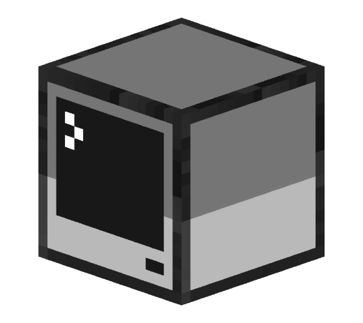


   
  <b>x86 Machine emulator</b> 
  <a href="./src">Source</a> |
  <a href="https://github.com/cryogen/VM86CS">Project</a> 
    
    


# Notice: 
*This is no longer maintained, purely uploaded and made public for those who are curious or wish to try fix any issues. Expect no future updates to this repo*


# Status

- [x] Machine load
- [x] Boot from floppy
- [ ] Boot from CD-ROM
- [ ] Boot from HDD


# To-Do

- Add mouse support
- Fix HDD images support
- Fix CD-ROM image support
- Find better way to show (F1,F2..etc) on touch screens


# Credits

Original developer:

- [Stuart Walsh](https://github.com/cryogen)

UWP port development:

- [Empyreal96](https://github.com/Empyreal96)
- [Bashar Astifan](https://github.com/basharast)


Win2D render solution from (RetriX):

- [Alberto Fustinoni](https://github.com/albertofustinoni)


